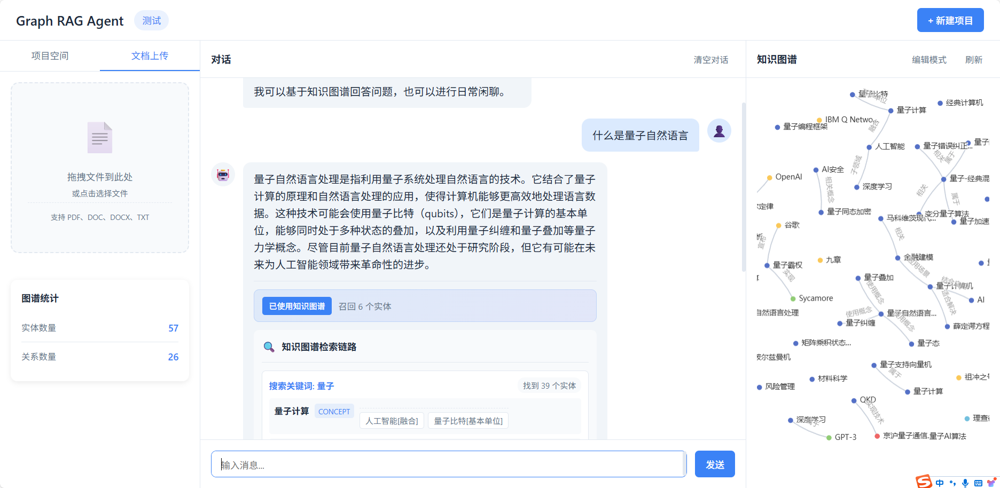

# Graph RAG Agent - 知识图谱对话Agent系统

简单的基于知识图谱的智能对话Agent系统，支持文档上传、知识图谱自动构建、可视化展示和智能问答。

## 功能特性

- **多项目管理**：支持创建、切换、删除多个独立项目
- **文档处理**：支持 PDF、DOC、DOCX、TXT 格式文档上传
- **知识图谱构建**：基于 LLM 自动提取实体和关系，构建知识网络
- **图谱可视化**：交互式 ECharts 力导向图展示，支持缩[放、拖拽
- **智能对话**：LangGraph Agent 决策是否使用知识图谱
- **流式输出**：SSE 实时流式展示回答，打字机效果
- **检索链路展示**：显示知识图谱召回过程和检索详情
- **图谱编辑**：支持实体和边的查看、新增、编辑、删除

## 技术栈

| 层级 | 技术选型 |
|------|----------|
| 后端框架 | Python + FastAPI + LangChain |
| Agent框架 | LangGraph v1.0 |
| 图数据库 | NetworkX（内存存储） |
| LLM API | MiniMax (abab6.5s-chat) |]()
| 前端框架 | 原生 HTML/JS + CSS |
| 可视化 | ECharts |
| 文档解析 | PyPDF2、python-docx |

## 项目结构

```
Graph-Agentic-RAG/
├── backend/                      # 后端服务
│   ├── app/
│   │   ├── main.py               # FastAPI 入口
│   │   ├── config.py             # 配置管理
│   │   ├── api/
│   │   │   ├── routes.py         # API 路由（对话、文件上传）
│   │   │   ├── project_routes.py # 项目管理 API
│   │   │   └── models.py         # 请求/响应模型
│   │   ├── services/
│   │   │   ├── document_processor.py  # 文档处理
│   │   │   ├── graph_builder.py       # 知识图谱构建
│   │   │   ├── graph_manager.py       # NetworkX 图管理
│   │   │   ├── llm_service.py         # LLM 调用
│   │   │   ├── project_manager.py     # 项目管理
│   │   │   └── agent.py               # LangGraph Agent
│   │   └── utils/
│   │       └── prompts.py        # 提示词模板
│   ├── requirements.txt          # Python 依赖
│   └── .env.example              # 环境变量模板
├── frontend/                     # 前端页面
│   ├── index.html               # 主页面
│   ├── css/style.css            # 样式文件
│   └── js/
│       ├── api.js               # API 调用封装
│       ├── chat.js              # 对话逻辑（SSE流式）
│       └── graph.js             # 图谱可视化管理
├── data/
│   └── uploads/                 # 上传文件存储
└── README_CN.md                 # 文档
```

## 快速开始

### 1. 克隆项目

```bash
git clone https://github.com/yourusername/Graph-Agentic-RAG.git
cd Graph-Agentic-RAG
```

### 2. 安装后端依赖

```bash
cd backend
pip install -r requirements.txt
```

### 3. 配置环境变量

```bash
cp .env.example .env
# 编辑 .env 文件，填入 MiniMax API Key
```

`.env` 配置示例：

```env
MINIMAX_API_KEY=your_api_key_here
MINIMAX_API_URL=https://api.minimax.chat/v1/text/chatcompletion_v2
MINIMAX_MODEL=abab6.5s-chat
HOST=0.0.0.0
PORT=8000
```

### 4. 启动服务

```bash
cd backend
uvicorn app.main:app --reload --port 8000
```

### 5. 访问应用

浏览器打开：[http://localhost:8000](http://localhost:8000)

## 使用流程

### 创建项目

1. 点击顶部「+ 新建项目」按钮
2. 输入项目名称和描述
3. 创建后自动切换到该项目

### 上传文档

1. 切换到「文档上传」标签页
2. 拖拽或点击选择文件（支持 PDF、DOC、DOCX、TXT）
3. 等待文档解析和图谱构建完成
4. 可在右侧查看图谱可视化

### 智能问答

1. 在中间对话区域输入问题
2. 回答会实时流式输出
3. 如果使用了知识图谱，底部会显示：
   - 知识图谱检索链路（搜索关键词 → 召回实体 → 邻居关系）
   - 召回实体列表

### 图谱编辑

- **实体**：点击图谱节点查看详情，支持重命名和删除
- **边**：支持查看、新增、修改、删除关系

## API 接口

| 接口 | 方法 | 说明 |
|------|------|------|
| `/api/upload` | POST | 上传文档文件 |
| `/api/projects` | GET | 获取项目列表 |
| `/api/projects` | POST | 创建项目 |
| `/api/projects/{id}` | DELETE | 删除项目 |
| `/api/graph` | GET | 获取图谱数据 |
| `/api/graph/stats` | GET | 获取图谱统计 |
| `/api/graph/entity/search` | GET | 搜索实体 |
| `/api/chat/stream` | GET | SSE 流式对话 |

## Agent 工作流程

```
用户问题
    ↓
┌─────────────────┐
│  路由决策节点    │ ← 判断是否需要知识图谱
└────────┬────────┘
         │
    使用图谱？──否──→ 直接生成回答
         │是
         ↓
┌─────────────────┐
│  图谱检索节点    │ ← 关键词搜索 → 实体匹配 → 邻居查找
│  (检索链路追踪)  │
└────────┬────────┘
         ↓
┌─────────────────┐
│  回答生成节点    │ ← 基于图谱上下文生成回答
└────────┬────────┘
         ↓
    返回结果 + 检索链路
```

## 核心模块说明

### LangGraph Agent

位于 `backend/app/services/agent.py`，包含以下节点：

- **chat_node**：处理用户消息
- **decide_router**：判断是否使用知识图谱
- **retrieve_from_graph**：从图谱检索相关信息
- **generate_response**：生成最终回答
- **add_message_node**：添加助手消息到历史

### 知识图谱构建

位于 `backend/app/services/graph_builder.py`：

1. 文档分块
2. LLM 提取实体（名称、类型、描述、来源文本）
3. LLM 抽取关系（源实体、目标实体、关系类型、描述）
4. 构建 NetworkX 图

### 前端流式输出

使用 SSE（Server-Sent Events）实现：

1. 后端 `EventSourceResponse` 流式发送
2. 前端 `fetch + ReadableStream` 实时读取
3. 逐字更新显示，打字机效果
4. 完成时渲染检索链路

## 截图预览

> 

## 依赖环境

- Python 3.10+
- MiniMax API Key
- 浏览器（Chrome/Edge/Firefox）

## 后续优化方向

- [ ] 支持更多 LLM（OpenAI、Claude、本地模型）
- [ ] 图数据库持久化（Neo4j、Milvus）
- [ ] 向量检索增强（RAG）
- [ ] 用户认证系统
- [ ] 批量文件处理

## 许可证

MIT License

## 贡献

本项目只是一个小demo，仅供学习参考。
欢迎提交 Issue 和 Pull Request！
